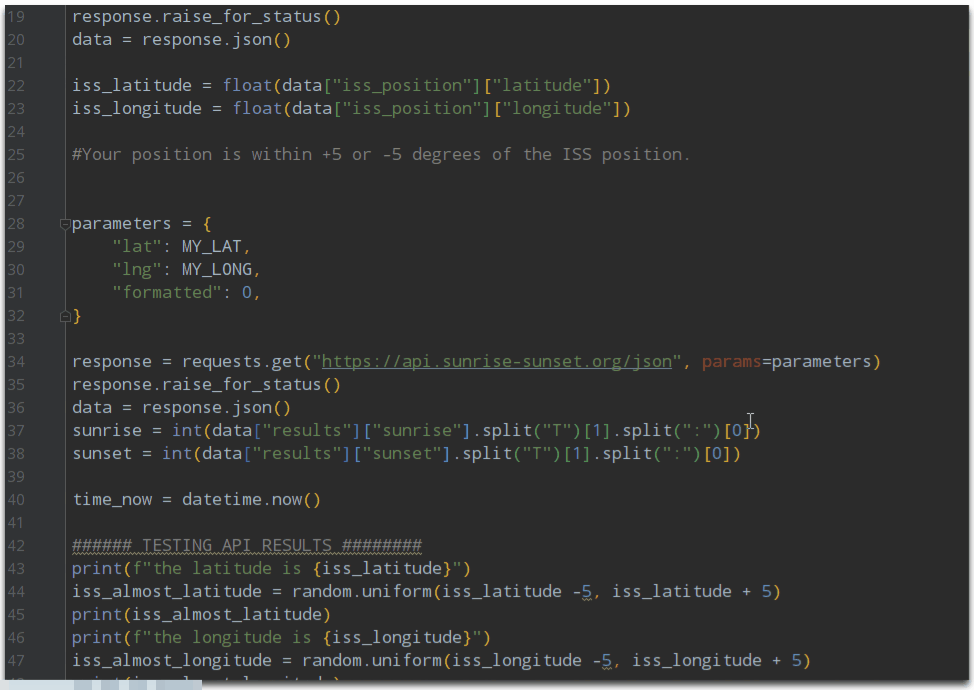

# International Space Station Tracker 🌌
Python code 🤖 that tracks where is the International Space Station (ISS) 🚀 currently at the sky. When the ISS is right above our location, we're going to send ourselves an email telling us to look up at the sky! 🌌

## What is the International Space Station?
The International Space Station (ISS) is a modular space station (habitable artificial satellite) in low Earth orbit. It is a multinational collaborative project involving five participating space agencies: NASA (United States), Roscosmos (Russia), JAXA (Japan), ESA (Europe), and CSA (Canada).

## Concepts Applied 🧐:
- [x] API Management 🎨
  
- [x] Lists comprehension 🤓

- [x] Handling Errors

## Sneak Peek Code
